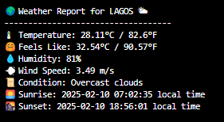

🌤 Weather Fetcher - Python Script
This Python script fetches real-time weather data for a specified city using the OpenWeatherMap API and displays key weather details like temperature, humidity, wind speed, and sunrise/sunset times.

🚀 How to Use
1️⃣ Prerequisites
Install Python (version 3.x recommended)
Install requests module if not already installed: pip install requests
Get a free API key from OpenWeatherMap.

2️⃣ Setup
Clone/download the script to your local machine.
Create a file named api_key.txt in the same directory as the script.
Paste your API key inside api_key.txt (no spaces or new lines).

3️⃣ Run the Script
Execute the script using: python weather_fetcher.py
Give the choice of city you would like to check its weather forcast

📜 Features
✅ Fetches real-time weather for any city
✅ Displays temperature in °C & °F
✅ Shows humidity, wind speed, and weather description
✅ Converts sunrise & sunset times to local time
✅ Handles API errors gracefully

📌 Example Output

